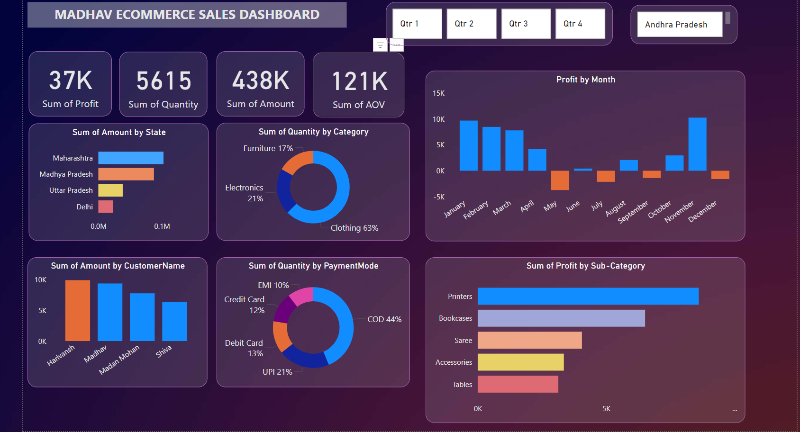

# Power BI Interactive Dashboard - Madhav Store E-commerce Sales Analysis

## Project Overview

This project involves creating an interactive **Power BI dashboard** for **Madhav Store** to help track and analyze their e-commerce sales. The goal is to provide the store owner with insights into key metrics like sales trends, product performance, payment methods, and customer behavior.



## Key Features

- **Total Profit**: ₹37K
- **Total Sales Quantity**: 5615 units
- **Total Sales Amount**: ₹438K
- **Average Order Value (AOV)**: ₹121K
- **State-wise Sales**: Maharashtra leads in sales, followed by Madhya Pradesh and Uttar Pradesh.
- **Category Performance**: Clothing accounts for 63% of sales, followed by electronics and furniture.
- **Payment Mode Analysis**: Cash on Delivery (COD) leads at 44%, followed by UPI and debit card.
- **Top Customers**: Harivansh, Madhav, and Madan Mohan.
- **Profit by Month**: December is the most profitable month, with significant gains in April and March.

## Power BI Basics Covered

- **Data Import and Transformation**: Extracted and cleaned the data for accurate analysis.
- **Visualizations**: Used bar charts, pie charts, and line charts for clear data representation.
- **Slicers and Filters**: Enabled dynamic filtering to analyze sales by quarters, states, and product categories.
- **DAX (Data Analysis Expressions)**: Applied DAX for custom calculations like profit, total sales, and AOV.

## Technologies Used

- **Power BI Desktop**: For data visualization and dashboard creation.
- **DAX**: For advanced metrics and calculations.
- **CSV Data**: Used the dataset provided by Madhav Store for this project.

## Installation and Setup

1. Download **Power BI Desktop** from [here](https://powerbi.microsoft.com/desktop/).
2. Clone this repository:
    ```bash
    git clone https://github.com/your-username/madhav-store-powerbi-dashboard.git
    ```
3. Open the `.pbix` file in **Power BI Desktop**.
4. Explore the dashboard and interact with filters and slicers.

## How to Use the Dashboard

- **State-wise Analysis**: Click on the state slicer to view sales specific to that region.
- **Category-wise Insights**: Use the category filter to analyze sales based on product categories like clothing, electronics, etc.
- **Quarterly Trends**: Filter sales performance by quarters to identify patterns in different periods.
- **Payment Mode Analysis**: Understand customer payment preferences using the payment mode pie chart.

## Conclusion

This Power BI dashboard provides the Madhav Store owner with actionable insights to optimize their online sales strategy, improve inventory management, and understand customer preferences. 

Feel free to reach out for any feedback or collaboration opportunities!

## License

This project is licensed under the MIT License - see the [LICENSE](LICENSE) file for details.

## Contact

For more details or collaboration:
- **Name**: Punu N Gowda
- **Email**: punungowda6@gmail.com
- **LinkedIn**: [Punu N Gowda](https://www.linkedin.com/in/punungowda/)
